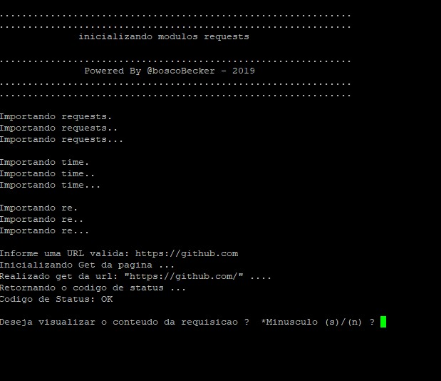

# Project developed in Python to make HTTP 1.0 / 1.1 requests using Requests library

#Requirements
* Python 2.7
* Requsts Library
* Time Library
* Library
* Library re

#operation

1 Just run the "python app.py" commands

2 inform the URL

3 choose whether to view the HTML content or not

#Parts of the request status verification code

`` python
# returning basic Status Codes,
def statusCode (code):
    if code == '100':
     return 'Continue'
    if code == '200':
      return 'OK'
    if code == '201':
     return 'Created - Created'
    if code == '400':
        return 'Bad Rquest - Bad Request'
    if code == '403':
        return 'Forbidden - Forbidden'
    if code == '404':
        return 'Page not found - page not found'
    if code == '300':
     return 'multiple choices'

``

## The main idea is to create a Wget-style app, make HTTP requests
## Use and abuse this App.

#make with Love @boscobecker

